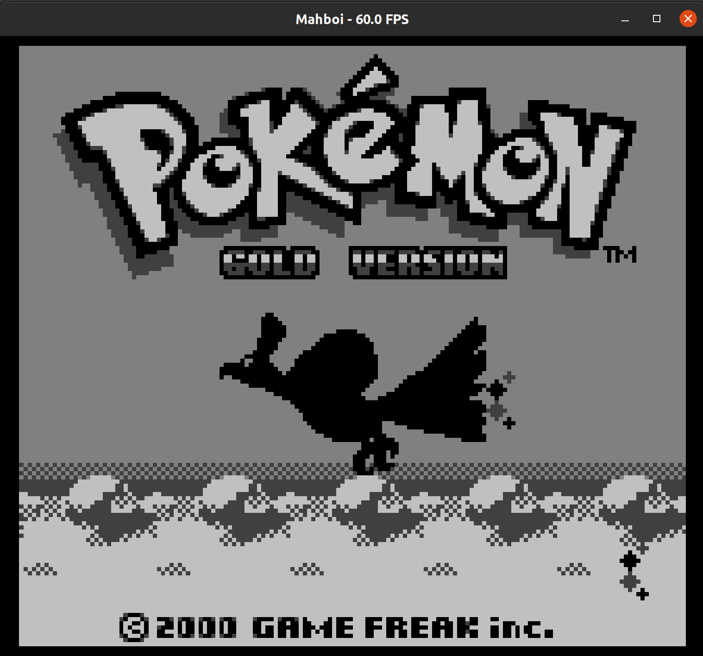
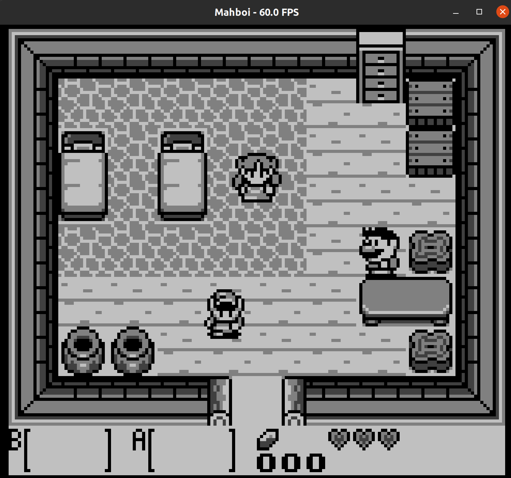
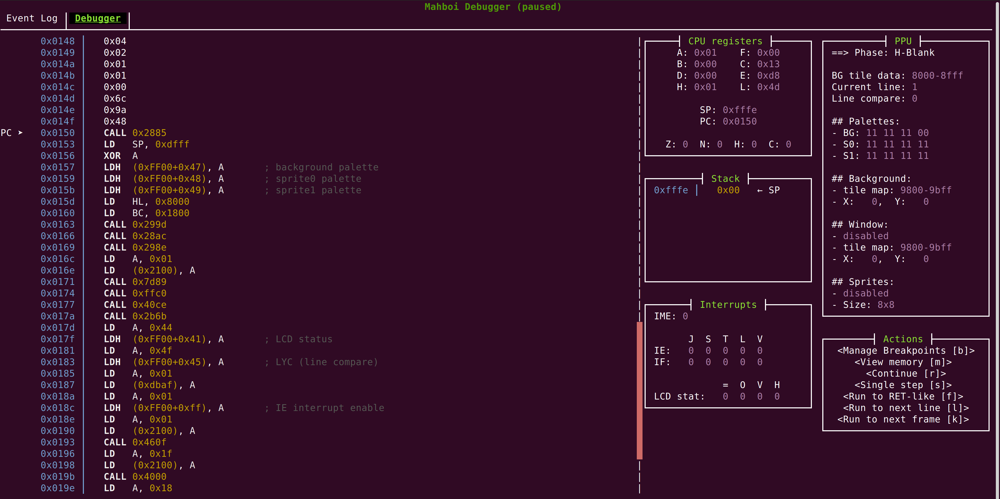

Mahboi – yet another Game Boy emulator
======================================

This is merely a hobby project of ours.
Our goal is just to play a couple games we enjoyed when we were young :)
Feel free to check out the code or try it for yourself.
But you most certainly want to use a different emulator if you plan on actually playing games.
We have a somewhat nice debugger though!

    </img>
    </img>

    </img>

## Building and Running

You need a somewhat recent version of Rust and Cargo to compile this project.
To run the emulator, your system needs to support Vulkan (as we depend on `pixels`, which uses `wgpu`, which uses Vulkan).

On Linux, you additionally need some native libraries:

- ALSA sound (`libasound2-dev` on Ubuntu)
- Ncurses (`libncurses-dev` and `libncursesw6` on Ubuntu)
- You maybe need these ones as well (but I'm not sure, sorry :D): `libxkbcommon-dev libwayland-cursor0 libwayland-dev`

## Documentation and Information

There is some information and a couple of links [in the wiki](https://github.com/LukasKalbertodt/mahboi/wiki).

A very rough roadmap with things that still need to be fixed can be seen here: https://github.com/LukasKalbertodt/mahboi/issues/39

---

## License

Licensed under either of

 * Apache License, Version 2.0, ([LICENSE-APACHE](LICENSE-APACHE) or http://www.apache.org/licenses/LICENSE-2.0)
 * MIT license ([LICENSE-MIT](LICENSE-MIT) or http://opensource.org/licenses/MIT)

at your option.

### Contribution

Unless you explicitly state otherwise, any contribution intentionally submitted
for inclusion in the work by you, as defined in the Apache-2.0 license, shall
be dual licensed as above, without any additional terms or conditions.
